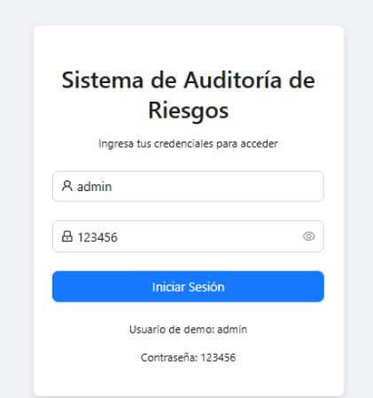
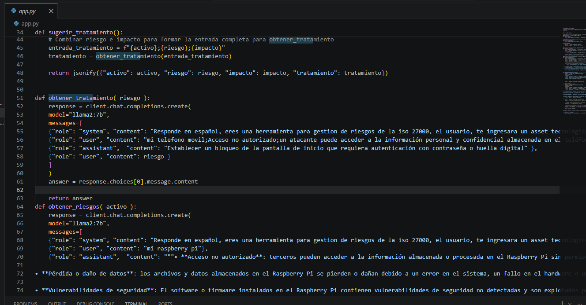

# Informe de Auditoría de Sistemas - Examen de la Unidad I

**Nombres y apellidos:** Jerson Roni Chambi Cori
**Fecha:** 22 de abril de 2026
**URL GitHub:** https://github.com/JersonCh/ExamenPractico 

## 1. Proyecto de Auditoría de Riesgos

### Login
**Evidencia:**

**Descripción:** 
Se implementó un inicio de sesión ficticio en el frontend (React) compuesto por `Login.jsx` y `LoginService.js`. Esta implementación valida de forma estática las credenciales ingresadas (usuario: *admin*, contraseña: *123456*). Al coincidir, simula un tiempo de conexión, genera un token ficticio y lo almacena junto con el usuario en el `localStorage` del navegador para mantener la sesión activa, simulando una autenticación sin depender de una base de datos real.

### Motor de Inteligencia Artificial
**Evidencia:**

**Descripción:** 
Se modificó el archivo `app.py` (Backend en Flask) integrando el cliente de `OpenAI` adaptado a un entorno local conectándose al puerto `11434` (Ollama). El cambio más importante fue la actualización del motor/modelo utilizado: pasamos de modelo `ramiro:instruct` a utilizar `llama2:7b`, según los requisitos del sistema, para procesar la evaluación de activos tecnológicos, los riesgos y los tratamientos recomendados.

## 2. Hallazgos

A continuación, la evaluación de 5 activos seleccionados de la lista brindada:

**Activo 1: Servidor de base de datos**
*   **Evidencia:** (Pegue aquí la captura de pantalla del frontend procesando este activo)
*   **Condición:** Acceso no autorizado a la base de datos debido a mala configuración de puertos o credenciales débiles.
*   **Recomendación:** Implementar reglas de firewall más estrictas, utilizar autenticación robusta y cifrar los datos en reposo y tránsito.
*   **Riesgo:** Alta

**Activo 2: Aplicación Web de Banca**
*   **Evidencia:** (Pegue aquí la captura de pantalla del frontend procesando este activo)
*   **Condición:** Vulnerabilidad de inyección SQL identificada en los formularios de la web.
*   **Recomendación:** Sanitizar todas las entradas enviadas por el usuario y utilizar consultas o ORM seguro.
*   **Riesgo:** Alta

**Activo 3: Backup en NAS**
*   **Evidencia:** (Pegue aquí la captura de pantalla del frontend procesando este activo)
*   **Condición:** Las copias de seguridad de datos sensibles se guardan en texto plano en la unidad NAS expuesta a la red interna.
*   **Recomendación:** Encriptar físicamente los discos de los backups y restringir el acceso a usuarios/servidores con llaves.
*   **Riesgo:** Media

**Activo 4: Firewall Perimetral**
*   **Evidencia:** (Pegue aquí la captura de pantalla del frontend procesando este activo)
*   **Condición:** El firewall no ha actualizado sus reglas de prevención de intrusos.
*   **Recomendación:** Habilitar rutinas automáticas de actualización de firmas y monitorear el SIEM.
*   **Riesgo:** Alta

**Activo 5: Autenticación MFA**
*   **Evidencia:** (Pegue aquí la captura de pantalla del frontend procesando este activo)
*   **Condición:** Los métodos de recuperación de contraseña SMS pueden estar interceptados (SIM Swapping).
*   **Recomendación:** Implementar una app de autenticación de tiempo (TOTP) o tokens en hardware antes que permitir códigos SMS.
*   **Riesgo:** Alta
